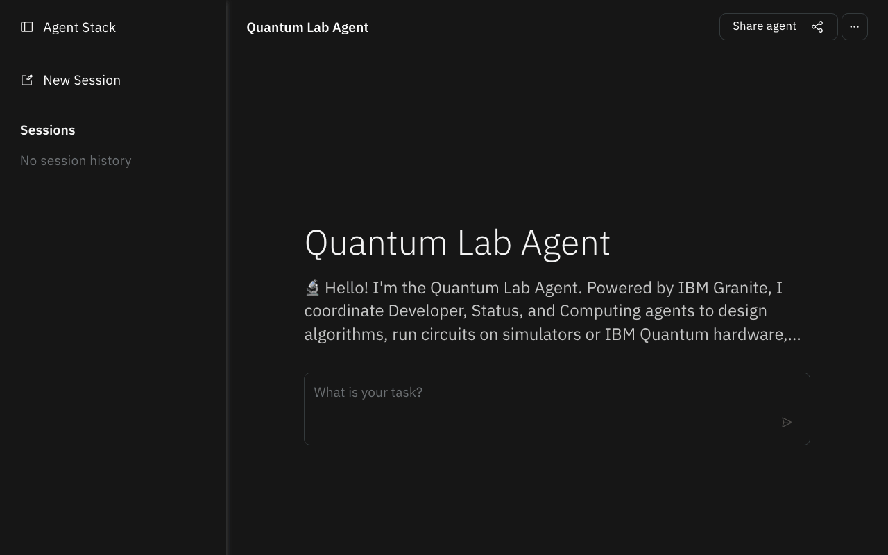
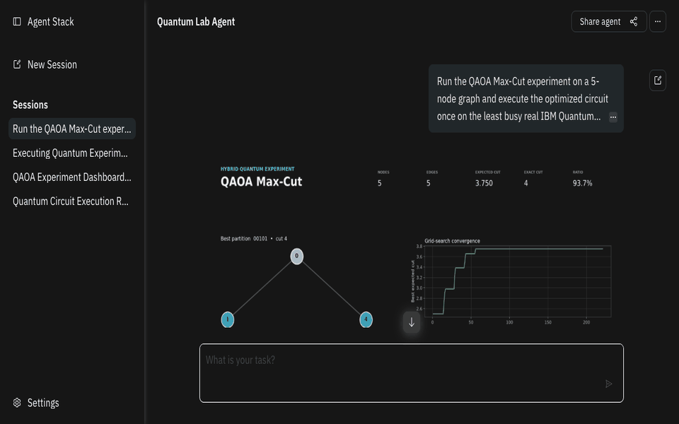

<div align="center">

# ⚛️ Quantum Lab Agent System

### A complete multi-agent workspace for IBM Quantum

[](https://www.python.org/)
[](https://www.ibm.com/granite)
[](https://github.com/a2aproject/A2A)
[](https://quantum.cloud.ibm.com/)

Generate quantum code, inspect live IBM Quantum backends, execute circuits on real
hardware, and retrieve job results through one coordinated interface.

[Quick start](#-quick-start) · [Architecture](#-architecture) · [Try it](#-try-it) · [Repositories](#-public-agent-repositories)

</div>

---

## Overview

This repository contains the complete multi-agent system. The **Quantum Lab Agent** is the main entry point: it coordinates the Developer, Status, Computing, and development-stage Experiment agents through the Agent-to-Agent protocol.

Local inference uses **IBM Granite 4.2 8B** through Ollama by default.

> [!IMPORTANT]
> Full functionality requires all five agents to be running. Start the four specialized agents before the Lab Agent, or simply use `./start_all.sh`.

| Agent | Responsibility | Port | Public repository |
|---|---|:---:|---|
| 🎯 **Quantum Lab Agent** | Main orchestrator coordinating all agents | `8000` | [quantum_lab_agent](https://github.com/BrUn3y/quantum_lab_agent) |
| 💻 **Quantum Developer Agent** | Code generation specialist | `8001` | [quantum-developer-agent](https://github.com/BrUn3y/quantum-developer-agent) |
| 📊 **Quantum Status Agent** | Status monitoring specialist | `8002` | [quantum-status-agent](https://github.com/BrUn3y/quantum-status-agent) |
| ⚡ **Quantum Computing Agent** | Circuit execution specialist | `8003` | [quantum-computing-agent](https://github.com/BrUn3y/quantum-computing-agent) |
| 🧪 **Quantum Experiment Agent (Development)** | Hybrid experiment and optimization specialist | `8004` | [quantum-experiment-agent](https://github.com/BrUn3y/quantum-experiment-agent) |

## 🎬 Demo

<p align="center">
  
</p>

<p align="center"><em>Grover circuit generation, coordinated execution, measurement results, and circuit visualization in Agent Stack Canvas.</em></p>

### QAOA experiment on real IBM Quantum hardware

<p align="center">
  
</p>

<p align="center"><em>End-to-end QAOA Max-Cut: exact classical validation, experiment Canvas, execution on <code>ibm_marrakesh</code>, tagged Job ID, and live results from 1,024 shots.</em></p>

```text
Run the QAOA Max-Cut experiment on a 5-node graph and execute the optimized circuit once on the least busy real IBM Quantum backend with 1024 shots. Always create a new job and return the backend name and Job ID.
```

## 🏗️ Architecture

<p align="center">
  
</p>

```text
User request
     │
     ▼
Lab Agent :8000
     ├── Developer :8001 ── Generate QASM and explain concepts
     ├── Status    :8002 ── Inspect backends and quantum jobs
     ├── Computing :8003 ── Execute circuits ──► IBM Quantum
     └── Experiment:8004 ── Optimize QAOA/VQE studies ──► Computing
```

The Lab Agent combines the specialized responses into a single answer containing the generated circuit, selected backend, IBM Quantum Job ID, status, or measurement results.

## ✨ Capabilities

| Capability | What it provides |
|---|---|
| 🎯 **Intelligent routing** | Selects the correct specialized agent for each prompt |
| 💻 **Code generation** | Produces OpenQASM, Qiskit code, and common quantum algorithms |
| ⚡ **Real execution** | Submits circuits to accessible IBM Quantum hardware |
| 📊 **Live monitoring** | Retrieves backend availability, queues, job state, and results |
| 🗺️ **Backend Canvas** | Shows a live topology and health dashboard for specific `ibm_*` backend queries |
| 📈 **Execution Canvas** | Presents fresh job results, readable multi-row circuits, QASM, and local query timestamps |
| 🔄 **Multi-agent workflows** | Chains generation → execution → result inspection |
| 🧪 **Hybrid experiments** | Runs QAOA Max-Cut optimization, exact validation, Canvas analysis, and optional QPU evaluation *(development)* |
| 🧠 **Local inference** | Runs IBM Granite 4.2 8B through Ollama |

## 🚀 Quick start

### Requirements

- Python `3.11+`
- [uv](https://github.com/astral-sh/uv)
- [Ollama](https://ollama.com/) with `granite4.2:8b`
- An [IBM Quantum account](https://quantum.cloud.ibm.com/)

### 1. Clone and install

```bash
git clone https://github.com/BrUn3y/quantum_lab_agent.git
cd quantum_lab_agent
uv sync
ollama pull granite4.2:8b
```

### 2. Configure credentials

```bash
cp .env.example .env
```

Add your IBM Quantum token to `.env`. The default model configuration is:

```dotenv
QISKIT_IBM_TOKEN=your_ibm_quantum_token
OLLAMA_API_BASE=http://127.0.0.1:11434

LAB_MODEL=ollama:granite4.2:8b
DEVELOPER_MODEL=ollama:granite4.2:8b
STATUS_MODEL=ollama:granite4.2:8b
COMPUTING_MODEL=ollama:granite4.2:8b
```

Watsonx remains available as an optional fallback through the `WATSONX_*` variables documented in [`.env.example`](.env.example).

### 3. Start the complete system

```bash
./start_all.sh
```

Or start each service in a separate terminal:

```bash
./start_developer.sh  # Port 8001
./start_status.sh     # Port 8002
./start_computing.sh  # Port 8003
./start_experiment.sh # Port 8004 — development
./start_lab.sh        # Port 8000 — start last
```

### View agent logs

The start scripts write separate logs to `.logs/`. Follow every agent in one terminal:

```bash
./view_logs.sh
```

Select one agent or print a snapshot without following new output:

```bash
./view_logs.sh lab
./view_logs.sh computing -n 200
./view_logs.sh all --no-follow
```

### 4. Verify every agent

```bash
for port in 8000 8001 8002 8003 8004; do
  curl -fsS "http://127.0.0.1:${port}/.well-known/agent-card.json" \
    | jq -r '.name'
done
```

## 💬 Try it

All requests enter through the Lab Agent's A2A JSON-RPC endpoint:

```bash
curl -X POST http://127.0.0.1:8000/jsonrpc/ \
  -H "Content-Type: application/json" \
  -d '{
    "jsonrpc": "2.0",
    "id": "quantum-demo",
    "method": "message/send",
    "params": {
      "message": {
        "kind": "message",
        "messageId": "11111111-1111-4111-8111-111111111111",
        "role": "user",
        "parts": [{
          "kind": "text",
          "text": "Create a Bell state and execute it once on the least busy real IBM Quantum backend."
        }]
      }
    }
  }'
```

### Suggested prompts

| Goal | Prompt |
|---|---|
| Bell state end-to-end | `Create a Bell state, execute it on the local simulator with 1024 shots, and explain the results` |
| Grover search | `Create Grover's algorithm for 3 qubits and run it on the local simulator` |
| Real QPU execution | `Create a Bell state and execute it once on the least busy real IBM Quantum backend` |
| List available QPUs | `What quantum computers are available?` |
| Inspect a backend | `Give me detailed information about ibm_fez` |
| Deutsch–Jozsa | `Create and execute a Deutsch-Jozsa circuit for a balanced oracle` |
| QAOA Max-Cut *(development)* | `Use QAOA to solve Max-Cut on a 5-node graph using the local simulator` |
| Explain a concept | `Explain what quantum entanglement is` |
| Check a job | `Show me the status and results of job <job-id>` |

Backend availability depends on the IBM Quantum account. The agent queries the live service and chooses among the backends actually accessible to the configured account.

## 🧪 End-to-end tests

Run the live suite to verify all five services, execute Bell, CX, Grover, and Deutsch–Jozsa circuits through the Lab → Developer → Computing flow, and validate a QAOA Max-Cut experiment through the Experiment Agent:

```bash
./test_e2e.sh
```

The suite uses the agents already running on ports `8000`–`8004`. If none are running, it starts all five with `granite4.2:8b`, waits for their agent cards, runs every circuit and experiment on local simulators, and stops only the processes it started. Logs from an automatic startup are written to `.logs/e2e/`.

Useful options:

```bash
./test_e2e.sh --no-start        # Require an existing five-agent system
./test_e2e.sh --shots 256       # Change the number of simulator shots
./test_e2e.sh --timeout 300     # Allow slower local environments
```

Custom `--lab-port`, `--developer-port`, `--status-port`, `--computing-port`, and `--experiment-port` options are available for isolated or parallel test environments.

## ⚙️ Configuration

| Variable | Default | Purpose |
|---|---|---|
| `OLLAMA_API_BASE` | `http://127.0.0.1:11434` | Ollama endpoint |
| `LAB_MODEL` | `ollama:granite4.2:8b` | Lab orchestrator model |
| `DEVELOPER_MODEL` | `ollama:granite4.2:8b` | Code generation model |
| `STATUS_MODEL` | `ollama:granite4.2:8b` | Status model |
| `COMPUTING_MODEL` | `ollama:granite4.2:8b` | Execution model |
| `LAB_PORT` | `8000` | Lab Agent port |
| `DEVELOPER_PORT` | `8001` | Developer Agent port |
| `STATUS_PORT` | `8002` | Status Agent port |
| `COMPUTING_PORT` | `8003` | Computing Agent port |
| `EXPERIMENT_PORT` | `8004` | Experiment Agent port *(development)* |

## 🔁 How requests are handled

| Request | Agents involved |
|---|---|
| “Generate a teleportation circuit” | Developer |
| “Create a Bell state and run it” | Developer → Computing |
| “Which backends are available?” | Status |
| “Check job `…` and show its results” | Status |
| “Create, execute, and inspect the result” | Developer → Computing → Status |
| “Use QAOA to solve a 5-node Max-Cut problem” | Experiment → Computing *(when QPU execution is requested)* |

## 🐳 Docker

The included image runs the Lab Agent. Start the four specialized agents on the host, then build and run the orchestrator:

```bash
docker build -t quantum-lab-agent .
docker run --env-file .env -p 8000:8000 quantum-lab-agent
```

The Developer, Status, Computing, and Experiment agents must remain reachable through the host and port values configured in `.env`. For an all-local setup, `./start_all.sh` is the recommended option.

## 🧰 Troubleshooting

| Problem | Check |
|---|---|
| A workflow is incomplete | Confirm that all five agent cards respond |
| Ollama cannot be reached | Run `ollama list` and confirm `granite4.2:8b` is installed |
| IBM Quantum authentication fails | Verify `QISKIT_IBM_TOKEN` in `.env` |
| A port is already occupied | Run `lsof -nP -iTCP:<port> -sTCP:LISTEN` |
| A named backend is unavailable | List the live backends and use one accessible to the account |

## 📁 Project structure

```text
quantum_lab_agent/
├── docs/images/architecture.png
├── docs/images/architecture.svg
├── docs/images/quantum-lab-demo.gif
├── docs/images/quantum-experiment-real-hardware.gif
├── src/beeai_agents/
│   ├── quantum_lab_agent.py
│   ├── quantum_developer_agent.py
│   ├── quantum_status_agent.py
│   ├── quantum_computing_agent.py
│   ├── quantum_experiment_agent.py
│   └── tools/
├── .env.example
├── Dockerfile
├── start_all.sh
├── start_lab.sh
├── start_developer.sh
├── start_status.sh
├── start_computing.sh
├── start_experiment.sh
├── view_logs.sh
└── pyproject.toml
```

## 🔗 Public agent repositories

| Repository | Role |
|---|---|
| [Quantum Computing Agent](https://github.com/BrUn3y/quantum-computing-agent) | Circuit execution specialist |
| [Quantum Status Agent](https://github.com/BrUn3y/quantum-status-agent) | Status monitoring and job tracking |
| [Quantum Developer Agent](https://github.com/BrUn3y/quantum-developer-agent) | Code generation and algorithm implementation |
| [Quantum Lab Agent](https://github.com/BrUn3y/quantum_lab_agent) | Main orchestrator coordinating all agents |
| [Quantum Experiment Agent](https://github.com/BrUn3y/quantum-experiment-agent) | Hybrid optimization and experiment analysis *(in development)* |

## Contributing

Issues and pull requests are welcome. When changing a workflow, validate all five agent endpoints and include an end-to-end prompt test.

---

<div align="center">

Built with [BeeAI Framework](https://github.com/i-am-bee/beeai-framework), [IBM Granite](https://www.ibm.com/granite), [Qiskit](https://www.ibm.com/quantum/qiskit), and [IBM Quantum](https://quantum.cloud.ibm.com/).

</div>
