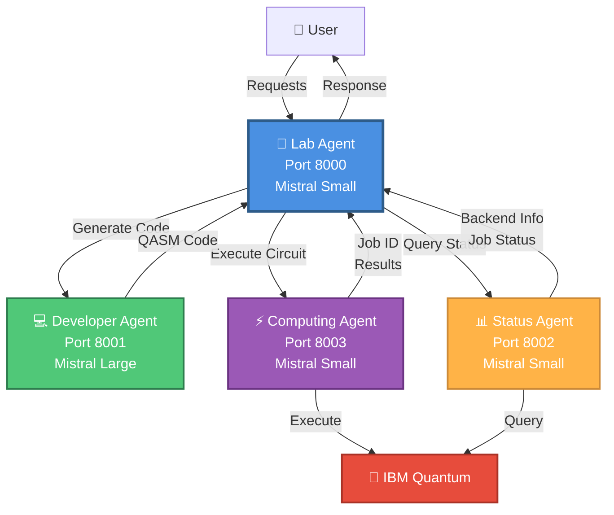
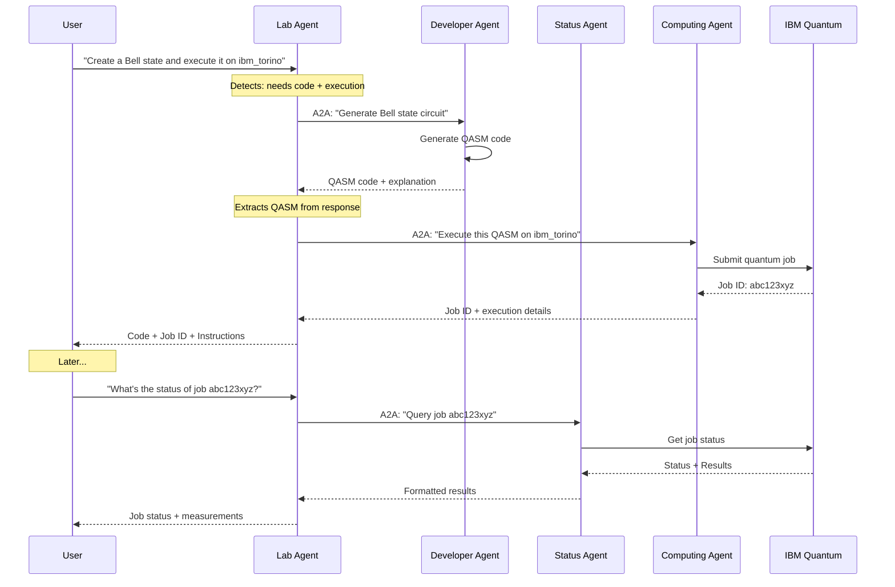
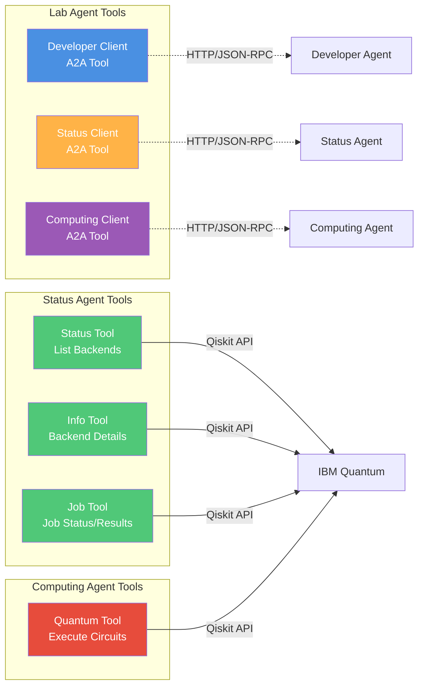

# 🔬 Quantum Lab Agent System

A multi-agent system for quantum computing operations using IBM Quantum, built with BeeAI Framework and configurable Watsonx or Ollama models.

## 🏗️ Architecture

The system consists of 4 specialized agents communicating via Agent-to-Agent (A2A) protocol:




### Agent Responsibilities

| Agent | Port | Model | Role | Tools |
|-------|------|-------|------|-------|
| **Lab** | 8000 | Mistral Small | Main orchestrator, coordinates all agents | 3 A2A clients |
| **Developer** | 8001 | Mistral Large | Code generation & explanations | None (pure LLM) |
| **Status** | 8002 | Mistral Small | Query backends & job status | 3 IBM Quantum tools |
| **Computing** | 8003 | Mistral Small | Execute quantum circuits | 1 IBM Quantum tool |

## 🔄 Communication Flow



## 🛠️ Tools Architecture



## 📋 Prerequisites

- Python 3.11+
- IBM Quantum account ([Get one here](https://quantum.cloud.ibm.com/))
- IBM Watsonx account with API key
- Ollama (optional, for local models such as `qwen3-coder:30b`)
- `uv` package manager (recommended) or `pip`

## 🚀 Quick Start

### 1. Clone and Setup

```bash
git clone <repository-url>
cd quantum_lab_agent

# Install dependencies
uv sync
# or
pip install -e .
```

### 2. Configure Environment

Create `.env` file from template:

```bash
cp .env.example .env
```

Edit `.env` with your credentials:

```env
# IBM Quantum
QISKIT_IBM_TOKEN=your_ibm_quantum_token_here

# Watsonx
WATSONX_API_KEY=your_watsonx_api_key_here
WATSONX_PROJECT_ID=your_project_id_here
WATSONX_API_URL=https://us-south.ml.cloud.ibm.com.....

# Models use BeeAI provider:model identifiers
OLLAMA_API_BASE=http://127.0.0.1:11434
DEVELOPER_MODEL=ollama:qwen3-coder:30b
LAB_MODEL=ollama:qwen3-coder:30b
STATUS_MODEL=ollama:qwen3-coder:30b
COMPUTING_MODEL=ollama:qwen3-coder:30b
```

For local inference, start Ollama and download the model before launching the agents:

```bash
ollama pull qwen3-coder:30b
```

The legacy `WATSONX_DEVELOPER_MODEL`, `WATSONX_LAB_MODEL`, `WATSONX_STATUS_MODEL`, and
`WATSONX_COMPUTING_MODEL` variables remain supported when their provider-agnostic counterparts are not set.

### 3. Start All Agents

```bash
# Start all 4 agents at once
./start_all.sh

# Or start individually:
./start_developer.sh   # Port 8001
./start_status.sh      # Port 8002  
./start_computing.sh   # Port 8003
./start_lab.sh          # Port 8000 (start this last)
```

### 4. Verify Agents are Running

```bash
# Check all agents
curl http://localhost:8000/.well-known/agent-card.json  # Lab
curl http://localhost:8001/.well-known/agent-card.json  # Developer
curl http://localhost:8002/.well-known/agent-card.json  # Status
curl http://localhost:8003/.well-known/agent-card.json  # Computing
```

## 💬 Usage Examples

Each agent is an A2A server. The agent card's `preferredTransport` is `JSONRPC`, served at `/jsonrpc/`, using the standard A2A `message/send` method. Requests are JSON-RPC 2.0 envelopes carrying an A2A `Message` (verified against a running agent):

### Example 1: Generate and Execute a Circuit

```bash
# Send request to Lab Agent (port 8000)
curl -X POST http://localhost:8000/jsonrpc/ \
  -H "Content-Type: application/json" \
  -d '{
    "jsonrpc": "2.0",
    "id": "1",
    "method": "message/send",
    "params": {
      "message": {
        "kind": "message",
        "messageId": "11111111-1111-1111-1111-111111111111",
        "role": "user",
        "parts": [{"kind": "text", "text": "Create a Bell state circuit and execute it on ibm_torino"}]
      }
    }
  }'
```

**What happens:**
1. Lab Agent receives request
2. Calls Developer Agent to generate QASM code
3. Extracts code from Developer's response
4. Calls Computing Agent to execute on ibm_torino
5. Returns Job ID and execution details

### Example 2: Query Available Backends

```bash
curl -X POST http://localhost:8000/jsonrpc/ \
  -H "Content-Type: application/json" \
  -d '{
    "jsonrpc": "2.0",
    "id": "2",
    "method": "message/send",
    "params": {
      "message": {
        "kind": "message",
        "messageId": "22222222-2222-2222-2222-222222222222",
        "role": "user",
        "parts": [{"kind": "text", "text": "What quantum computers are available?"}]
      }
    }
  }'
```

**What happens:**
1. Lab Agent receives request
2. Calls Status Agent to query backends
3. Status Agent uses `ibm_quantum_status` tool
4. Returns table with all available backends

### Example 3: Check Job Status

```bash
curl -X POST http://localhost:8000/jsonrpc/ \
  -H "Content-Type: application/json" \
  -d '{
    "jsonrpc": "2.0",
    "id": "3",
    "method": "message/send",
    "params": {
      "message": {
        "kind": "message",
        "messageId": "33333333-3333-3333-3333-333333333333",
        "role": "user",
        "parts": [{"kind": "text", "text": "What is the status of job abc123xyz?"}]
      }
    }
  }'
```

**What happens:**
1. Lab Agent receives request
2. Calls Status Agent with job ID
3. Status Agent uses `ibm_quantum_job` tool
4. Returns job status and results (if completed)

### Example 4: Execute Code from Memory

```bash
# First, generate code
curl -X POST http://localhost:8000/jsonrpc/ \
  -H "Content-Type: application/json" \
  -d '{
    "jsonrpc": "2.0",
    "id": "4",
    "method": "message/send",
    "params": {
      "message": {
        "kind": "message",
        "messageId": "44444444-4444-4444-4444-444444444444",
        "role": "user",
        "parts": [{"kind": "text", "text": "Create a superposition circuit"}]
      }
    }
  }'

# Then, execute it (code is in memory)
curl -X POST http://localhost:8000/jsonrpc/ \
  -H "Content-Type: application/json" \
  -d '{
    "jsonrpc": "2.0",
    "id": "5",
    "method": "message/send",
    "params": {
      "message": {
        "kind": "message",
        "messageId": "55555555-5555-5555-5555-555555555555",
        "role": "user",
        "parts": [{"kind": "text", "text": "Execute that circuit on ibm_kyiv"}]
      }
    }
  }'
```

**What happens:**
1. Lab Agent searches for QASM code in conversation history
2. Finds the code from previous message
3. Calls Computing Agent with the code
4. Returns Job ID

## 🔧 Development

### Project Structure

```
quantum_lab_agent/
├── src/beeai_agents/
│   ├── quantum_lab_agent.py          # Main orchestrator
│   ├── quantum_developer_agent.py    # Code generation
│   ├── quantum_status_agent.py       # Status queries
│   ├── quantum_computing_agent.py    # Circuit execution
│   └── tools/
│       ├── quantum_developer_client.py  # A2A client for Developer
│       ├── quantum_status_client.py     # A2A client for Status
│       ├── quantum_computing_client.py  # A2A client for Computing
│       ├── quantum_status_tool.py       # IBM Quantum status tool
│       ├── quantum_info_tool.py         # IBM Quantum info tool
│       ├── quantum_job_tool.py          # IBM Quantum job tool
│       └── quantum_tool.py              # IBM Quantum executor tool
├── start_all.sh           # Start all agents
├── start_developer.sh     # Start Developer Agent
├── start_status.sh        # Start Status Agent
├── start_computing.sh     # Start Computing Agent
├── start_lab.sh           # Start Lab Agent
├── .env.example          # Environment template
└── README.md             # This file
```

### Running Tests

```bash
# Test individual components
python test_quantum_status.py
python test_job_results.py
python test_bell_circuit.py
```

### Stopping Agents

```bash
# Stop all agents
pkill -f "quantum.*agent"

# Or stop individually
pkill -f "quantum_lab_agent"
pkill -f "quantum_developer_agent"
pkill -f "quantum_status_agent"
pkill -f "quantum_computing_agent"
```

## 📊 Monitoring

### View Agent Logs

```bash
# Lab Agent
tail -f /tmp/lab_agent.log

# Developer Agent  
tail -f /tmp/developer_agent.log

# Status Agent
tail -f /tmp/status_agent.log

# Computing Agent
tail -f /tmp/computing_agent.log
```

### Check Agent Health

```bash
# Check if agents are responding
for port in 8000 8001 8002 8003; do
  echo "Checking port $port..."
  curl -s http://localhost:$port/.well-known/agent-card.json | jq '.name'
done
```

## 🐛 Troubleshooting

### Agent Won't Start

**Problem:** Port already in use

```bash
# Find process using port
lsof -i :8000  # Replace with your port

# Kill process
kill -9 <PID>
```

**Problem:** Missing dependencies

```bash
# Reinstall dependencies
uv sync --reinstall
```

### Agent Not Responding

**Problem:** Watsonx API errors

- Check your API key in `.env`
- Verify project ID is correct
- Check Watsonx service status

**Problem:** IBM Quantum connection errors

- Verify your IBM Quantum token
- Check if you have access to the backends
- Try using a simulator instead of hardware

### Memory Issues

**Problem:** Lab Agent runs out of memory

- The Lab Agent uses `TokenMemory(max_tokens=6000)`
- Long conversations are automatically truncated
- Restart the agent to clear memory

## 📚 Additional Resources

- [BeeAI Framework Documentation](https://github.com/i-am-bee/beeai-framework)
- [IBM Quantum Documentation](https://docs.quantum.ibm.com/)
- [Qiskit Documentation](https://qiskit.org/documentation/)
- [Watsonx Documentation](https://www.ibm.com/products/watsonx-ai)

## 🤝 Contributing

Contributions are welcome! Please feel free to submit a Pull Request.

## 📄 License

This project is licensed under the Apache 2.0 License.

## 🙏 Acknowledgments

- Built with [BeeAI Framework](https://github.com/i-am-bee/beeai-framework)
- Powered by [IBM Watsonx](https://www.ibm.com/products/watsonx-ai)
- Quantum computing via [IBM Quantum](https://quantum.ibm.com/)
- LLMs: Mistral Large & Mistral Small

---

**Made with ❤️ using BeeAI, Qiskit, and IBM Quantum Lab**
